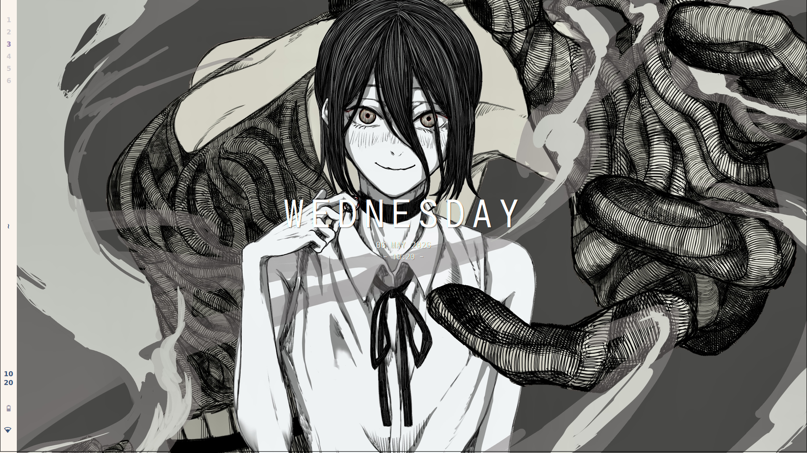
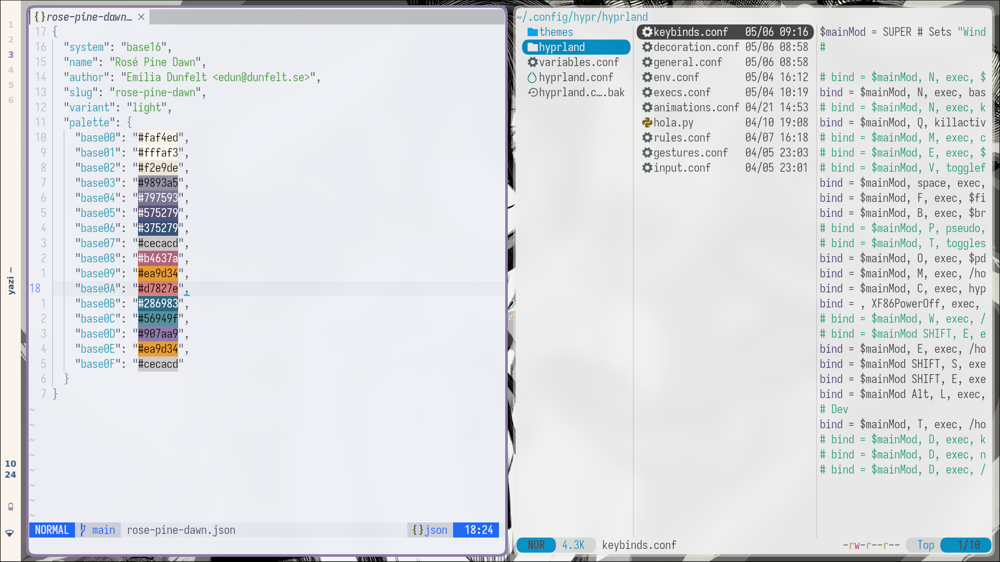

# Introduccion
En mi trayectoria del ricing en Hyprland me he topado con [Caelestia Shell](https://github.com/caelestia-dots/shell) al querer comprender como funcionaba desde cero me he adentrado en QML/Quickshell y apesar de mi intento por reutilizar sus dotfiles he optado por crear los mios propios tomando como inspiracion a esos dots. Inicialmente tenía en mente usar como *Source of true* un Wallpaper cualquiera pero al adentrarme en la generación de colorschemes a partir de una imagen he optado por utilizar Base16 para mis temas.
Sin duda todos estos dotfiles me han consumido más tiempo en la computadora que cualquier otra cosa, pero ha sigo una experiencia gratificante y divertida en el mundo linux.

## Screenshots

